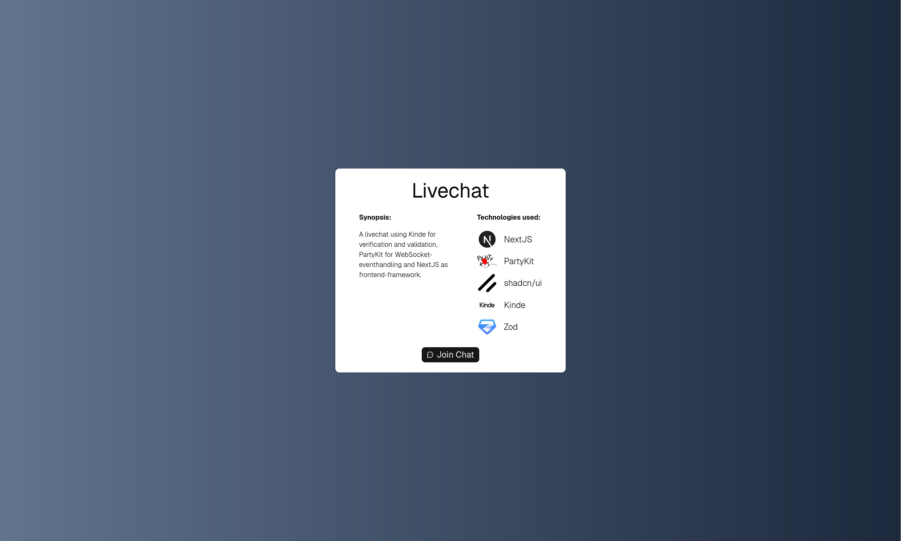
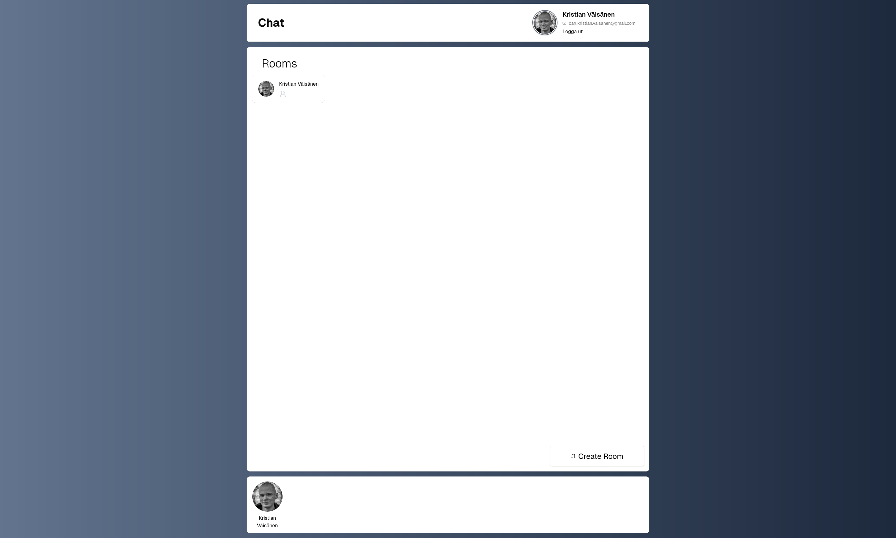

# Livechatt - Lexicon Solo Chat

Liten demo av en livechatt-frontend byggd med Next.js, PartyKit (partysocket) och Kinde för autentisering.  
Syfte: visa upp en realtidschatt med PartyKit för WebSocket-händelser, Kinde för användarautentisering och ett lättviktigt gränssnitt byggt med shadcn/ui + Tailwind.

__Detta repo innehåller endast den utvecklade frontend-koden för projektet.__
__Kod för Backend finns att se här: [Lexicon_Solo_Chat_Back](https://github.com/kippeves/Lexicon_Solo_Chat_Back)__

## Innehållsförteckning

- [Om projektet](#-om-projektet)
- [Teknologier som använts](#-teknologier-som-använts)
- [Bilder](#-bilder)
- [Funktioner](#-funktioner)
- [Projektstruktur](#-projektstruktur)
- [Lärdomar](#-lärdomar)
- [Installation](#-installation)
- [Miljö](#-miljö)
- [Noteringar](#-noteringar)
- [Licens](#-licens)


## 📖 Om projektet
Detta var ett individuellt projekt under kursen Webutvecklare - Frontend som utfördes på Lexicon Proffs AB. 

Målet var att:
- Självständigt kunna utveckla ett projekt med hjälp av NextJS (eller liknande ramverk) utifrån en designskiss.
- Kunna definiera vilka mål som som behöver uppnås samt vilka tekniker som behövs.
- Identifiera och strukturera de arbetsuppgifter som behövs utföras inom de tidsramar som har satts för uppgiften. 
- Med hjälp av GitHub Projects arbeta på ett strukturerat tillvägagångssätt.
- Arbeta med Feature Branches & Pull Requests.

## Arbetssätt:
Projektet pågick under två vecko-långa interationer där målet var att få klart en MVP under första veckan, för att sedan
kunna iterera över den under andra veckan.

Jag påbörjade arbetet med att göra en grundläggande skiss av vad jag ville att projektet skulle innefatta. 
Då det inte fanns någon möjlighet att köra monorepo så började jag med att: 
- Bryta upp projektet i en Frontend-del och en Backend-del då jag visste att jag skulle behöva deploya dem separat.
- Sätta jag upp två Github Projects-sida för dem som jag fyllde på med initialt identifierade uppgifter (Sätta upp server för backend och frontend, skapa första utkast av sidor etc)

Jag började således med att börja bocka av de tasks jag hade identifierat. I vissa fall så märkte jag att jag skulle behöva bryta upp tasks jag från början hade gjort för stora eller behövde göra på ett annat sätt, då bröt jag ner dem i mindre tasks eller skrev om dem helt vid behov. 
Om jag hittade fel i applikationen så skrev jag en bugg-task i Projects, skapade en PR på det och kopplade det till tasken.  Jag hade som en praxis att alltid ha Pull Requests och Tasks kopplade till de problem som jag aktivt jobbade på.

## 🛠 Teknologier som använts.
- Next.js (App Router, React 19, TypeScript)
- PartyKit & PartySocket - WebSocket-eventhantering
- Kinde (kinde-auth-nextjs) - Autentisering / sessionshantering
- shadcn/ui - UI-komponenter
- Tailwind CSS (v4)
- Zod - Validering av inkommande/utgående händelser
- Lucide-react - Ikoner
- Biome - Formatering & lintning

## 📷 Bilder

| Front | Lobby | Rum |
|---|---|---|
|  |  |  |

## ✨ Funktioner
- Skapa / gå med i rum (lobby)
- Realtidsmeddelanden med gruppering av meddelanden per datum
- Användarnärvaro & avatarmärkning
- Admin-kontroller: rensa meddelanden, stäng rum
- Server-side hjälpfunktioner för API-anrop till PartyKit

## 📂 Projektstruktur
- src/app — Next.js-routes och UI
- src/components — Delade UI-komponenter & ShadCN
- src/app/validators — Zod-scheman för strukturerade realtids-händelser
- src/app/chat — Chatt-sidor, actions och serverfunktioner
- src/app/hooks — Egna hooks (partysocket-integration)
- next.config.ts — Bilder & env-defaults

## 📚 Lärdomar
- NextJS & React
  - Parallel routes - För lobby & rum - I det här fallet för att minska duplicerad kod.
  - Serverside-funktioner - För de anrop som säkerhetsmässigt bör vara gömda från clientside.
- Kinde
  - Integration av OIDC i frontend och användarhantering både Server- och Client-side.
- PartyKit / WebSocket
  - Eventhantering, validering av objekt och presentation av data.
  - Säkerhet: JWT-validering mot backend.
- Zod
  - Validering av inkommande & utgående information
  - Generering av typer baserade på valideringsobjekt för en Single Source of Truth.


## ⚙ Installation

Installera beroenden:
```
- npm install
```

Utveckling:
```
- npm run dev
```

Bygg:
```
- npm run build
- npm start (produktion)
```

Formatering / lint (Tillsammans med Biome):
```
- npm run lint-format
```

## ⚙ Miljö
Skapa en .env.local med åtminstone följande variabler:
- PARTYKIT (PartyKit host URL)
- KINDE_CLIENT_ID, KINDE_ISSUER, KINDE_CLIENT_SECRET, etc. (som krävs av Kinde-konfigurationen)
- VERCEL_URL eller KINDE_SITE_URL för lokala dev-redirect-fallbacks

Notera: next.config.ts läser KINDE_* env-värden för redirect-standarder; justera vid behov.

## 📓 Noteringar
- Repot förväntar sig en PartyKit-host och en konfigurerat Kinde-projekt för autentisering.
- Zod-scheman validerar inkommande/utgående websocket-payloads, justera vid behov.

## § Licens
- Detta projekt är utvecklat i utbildningssyfte och är inte avsett för produktion.
